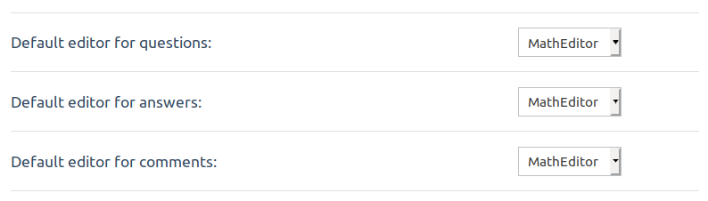
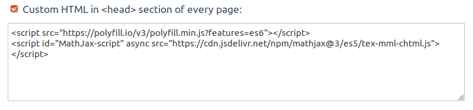
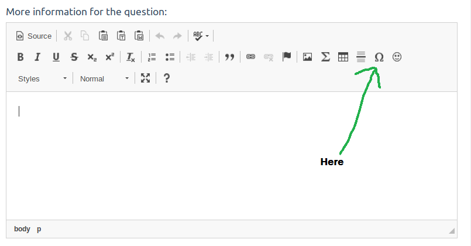
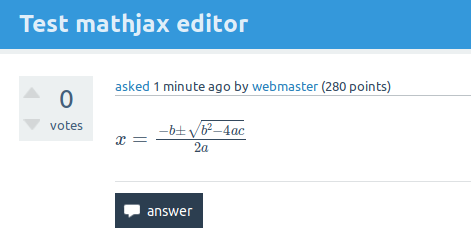
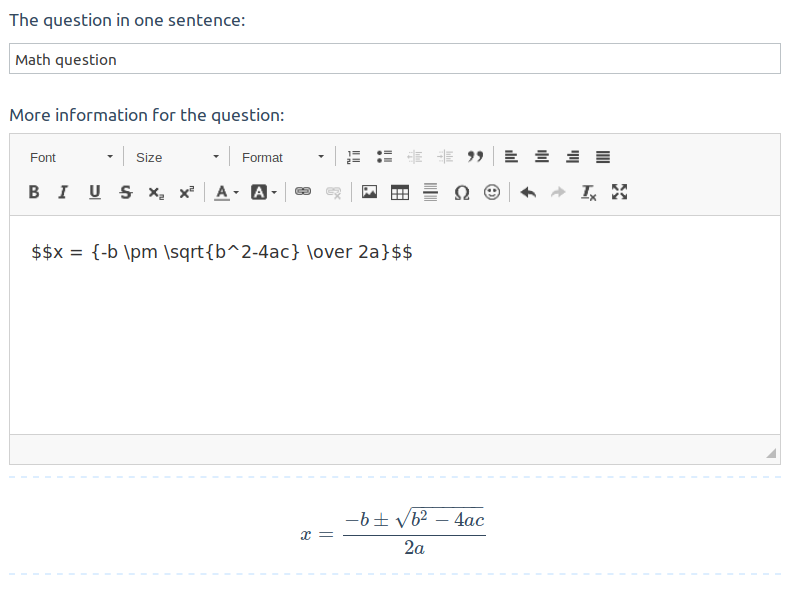
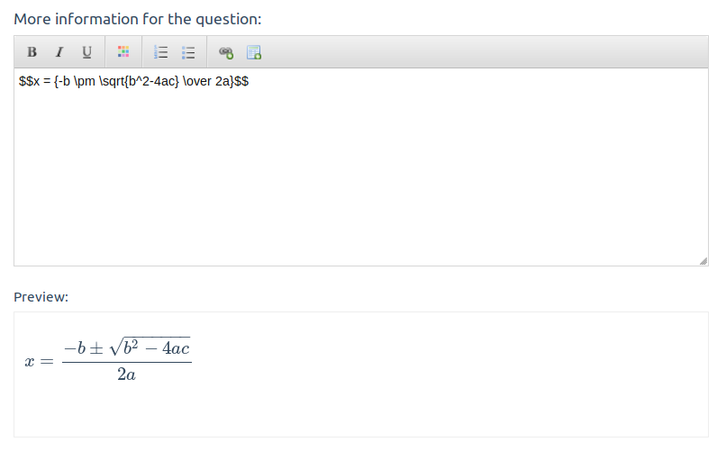

# :black_nib: Q2A Math Editor (LaTeX)

**06-08-2019 : Tested with 1.8.2** :heavy_check_mark:

## :clipboard: Description

This is a WYSIWYG Math formulas editor for [Question2Answers](https://www.question2answer.org/). 
 
Some history...

I made this plugin long time ago (right after the ckeditor 4 release) then I published it here looong time after (but already 5 years ago from now !). Finally, today (september 2019), I'm updating to **fix mathjax issue** and while we are here I update it to latest **CKEditor 4** version and improve documentation :smile:  

Since I first released this, [Question2Answers](https://www.question2answer.org/) team integrated natively the [CKEditor 4](https://github.com/ckeditor/ckeditor-dev) as WYSIWYG :thumbsup:

But this plugin is still good if you want to have Math formulas addon.


## :speech_balloon: Feedback

Please report any issue in the [issue board](https://github.com/thibaultduponchelle/q2a-ckeditor-latex/issues), this is a beta testing release and I think there's some small fixes to do.


## :carousel_horse: Install 

1. Download the plugin
2. Decompress in your **qa-plugin** directory
3. Enable **WYSIWYG Math Editor** in the **Admin** > **Posting** page.



4. Enable **MathJax** on your website by putting this code into **Admin** > **Layout** > **Custom HTML in HEAD** section of every page:

```
<script src="https://polyfill.io/v3/polyfill.min.js?features=es6"></script>
<script id="MathJax-script" async src="https://cdn.jsdelivr.net/npm/mathjax@3/es5/tex-mml-chtml.js"></script>
```

Like this : 



And you're done !

## :rainbow: Demo

When you go to post a question you will have this new WYSIWYG editor with an **Sigma** in the toolbar (+ various other plugins selected by me) : 



When you click on the **Sigma** button you will have a popup and you can start editing **Math Formulas** with a visual feedback : 


When you submit you message, you get your math YEAH : 



## :smiley_cat: Other Math Editors


### :purple_heart: Q2A Formatter

Please note that [q2a-formatter](https://github.com/tangruize/q2a-formatter) seems to work remarkably well (but it not doing the same job, math formulas are printed in a *preview* zone)



### :blue_heart: Q2APro SCEditor

[SCEditor](https://github.com/q2apro/q2apro-sceditor) seems very nice and has the same approach than q2a-formatter (preview zone).



### :broken_heart: The endless project

My other plugin [q2a-markdown-editor](https://github.com/thibaultduponchelle/q2a-markdown-editor-latex) is broken currently 

It was never really perfectly working. My fault, I'm not a javascript guy :crying_cat_face:)

### :star2: Other ideas 

Potentially, CKEditor 4 seems to have plugins available for math formulas but based on [MathQuill](http://mathquill.com) or **MathML**

## :couple_with_heart: Contribute 

If you find a bug or want to improve this plugin, please go ahead and create a **pull request** towards this repo, I will happily review and merge it. 

As I said, I'm not a javascript guy neither a PHP guy so I'm doing my best but honestly that's far from being sufficient :smile:


